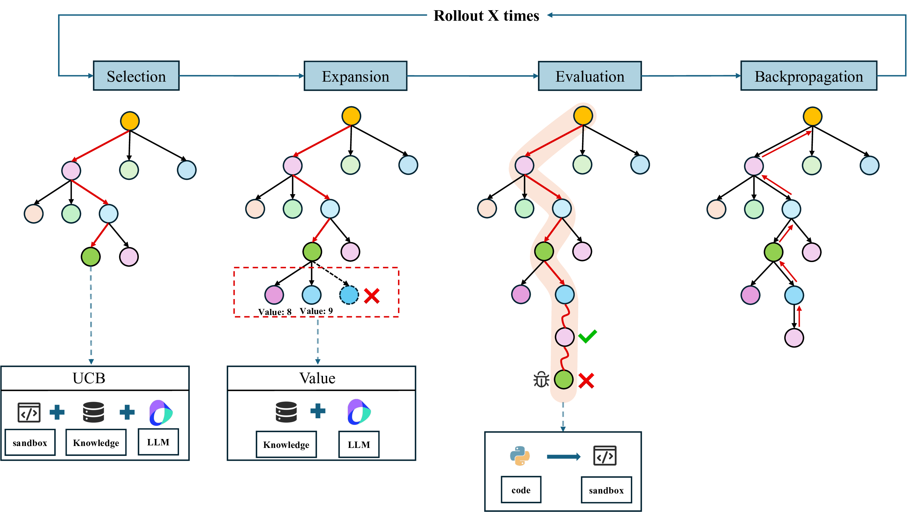

# RPM-MCTS: Knowledge-Retrieval as Process Reward Model with Monte Carlo Tree Search for Code Generation <!-- omit in toc -->

<p align="center">
  <a href="https://arxiv.org/abs/2511.19895"></a>
  <a href="https://github.com/codellm12842/RPM-MCTS"></a>
  <a href="https://openreview.net/forum?id=o3FLpLuj0Y"></a>
  <a href="https://aaai.org/conference/aaai/aaai-26/"></a>
</p>

This repository provides the implementation for **RPM-MCTS**.

<p align="center"></p>
<p align="center"><em>Figure.</em> Overview of RPM-MCTS.</p>

## Table of Contents <!-- omit in toc -->

- [Getting Started](#getting-started)
- [Reference Code](#reference-code)
- [Citation](#citation)

## Getting Started

1. Install dependencies
```
pip install -e .
```

2. Download embedding model
```
python huggingface/download.py
```

3. Build knowledge base
```
python rpm_mcts_tools/knowledge_base/vector_db_build_kb2.py
```

4. Run
```
python baselines/run_all.py
```

## Reference Code

- SRA-MCTS: [https://github.com/DIRECT-BIT/SRA-MCTS](https://github.com/DIRECT-BIT/SRA-MCTS)
- ReST-MCTS*: [https://github.com/THUDM/ReST-MCTS](https://github.com/THUDM/ReST-MCTS)

## Citation

```

```